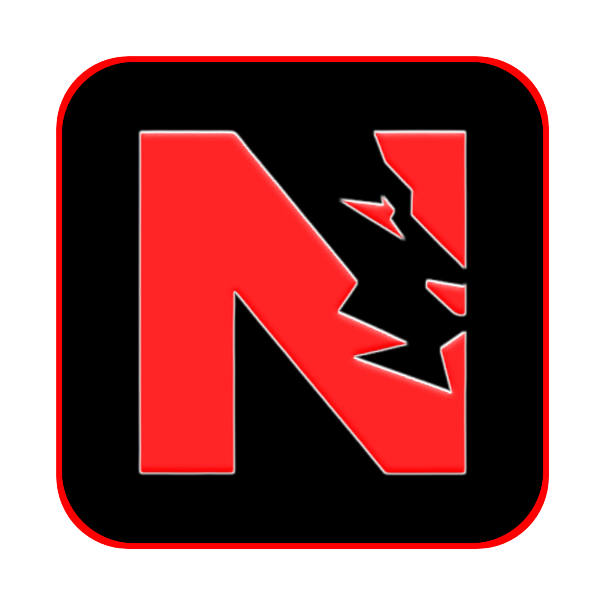

<!-- PROJECT LOGO -->
 

  

# **NepoFlix**
**✨ Click, watch, enjoy — your movies & TV shows, anytime. ✨**

  
  

  

---

## 📖 About This Project

> **NepoFlix** is a free and easy-to-use online streaming platform that brings movies, TV shows, and entertainment directly to your screen — no sign-ups, no subscriptions, no hassle.  
> With a sleek mobile-friendly interface, fast streaming, and multiple backup sources, NepoFlix ensures uninterrupted entertainment for everyone, everywhere.

[🌐 Visit Website](https://nepoflix-domains.github.io) • [📧 Contact](mailto:contact.nepoflix@gmail.com)

---

## ⚡ Features

<table>
<tr>
<td>

### 🎬 Content
- Extensive movie & TV library  
- Multi-language support  
- Download options  
- Trailers & extras

</td>
<td>

### 🎨 Design
- Modern, sleek interface  
- Fully mobile responsive  
- Smooth animations  
- Easy navigation

</td>
</tr>
<tr>
<td>

### 🛠 Technical
- Fast & lightweight  
- No registration needed  
- Multiple backup domains  
- Regular updates

</td>
<td>

### 🌟 Experience
- Watch Later list  
- Multiple streaming sources  
- One-click source switching  
- Smart filtered search

</td>
</tr>
</table>

---

## 🌐 Alternative Domains
If the main domain is unavailable, visit:  
➡️ **[NepoFlix Domain List](https://nepoflix-domains.github.io)**

---

## 🤝 Contributing
We welcome all contributions!  
- 🐛 Report bugs  
- 💡 Suggest features  
- 🔧 Submit pull requests

---

## 📝 License
You can host this project yourself — just give proper credit by linking to this repo.

---

## 👨‍💻 Author
**Sandip Gurung**  
- GitHub: [@Sandipeyy](https://github.com/Sandipeyy)  
- Instagram: [@sandipeyy_](https://instagram.com/sandipeyy_)

---

## ⭐ Star History

<a href="https://star-history.com/#Sandipeyy/NepoFlix&Timeline">
  <picture>
    <source media="(prefers-color-scheme: dark)" srcset="https://api.star-history.com/svg?repos=Sandipeyy/NepoFlix&type=Timeline&theme=dark" />
    <source media="(prefers-color-scheme: light)" srcset="https://api.star-history.com/svg?repos=Sandipeyy/NepoFlix&type=Timeline" />
    
  </picture>
</a>

---

👥 Contributors
Thanks to these amazing people for helping to make this project better!
This list updates automatically with every contribution.

<!-- The following image is generated by contrib.rocks and displays the avatars of all contributors. --> 

---

  Made with ❤️ by <a href="https://github.com/Sandipeyy">Sandipeyy</a>  
  •  
  <a href="mailto:contact.nepoflix@gmail.com">contact.nepoflix@gmail.com</a>

